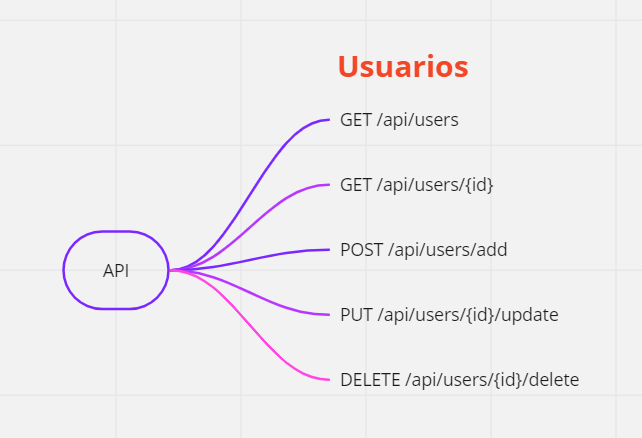

# Proyecto: diseño y bosquejo de una API

Considerar:

- La creación de nuevos elementos. Ejemplo: usuarios.
- Actualizar elementos.
- Eliminar elementos.
- Buscar elementos específicos.

Construir una API que pueda hacer funcionar los puntos antes mencionados, puede considerar cualquier plataforma existente.

### Diseño de una API

- Endpoint / Route / Path: sección de la URL de nuestro proyecto. La URL está conformada por:
    - Protocolo: http://
    - Nombre de dominio: www.tudominio.com
    - Endpoint: /api/users
- Modelo: tipo de dato en particular que se manejarán dentro de la aplicación. Ejemplo: Usuarios. Cada modelo contiene registros.

A continuación se describen los endpoints diseñados en el diagrama:

- GET /api/users → Obtiene una lista de usuarios.
- GET /api/users/{id} → Permite obtener un usuario en específico.
- POST /api/users/add → Permite crear un nuevo usuario. La información se envía a través de una petición post mediante formularios.
- PUT /api/users/{id}/update → Modifica la información de un usuario.
- DELETE /api/users/{id} → Elimina un usuario.